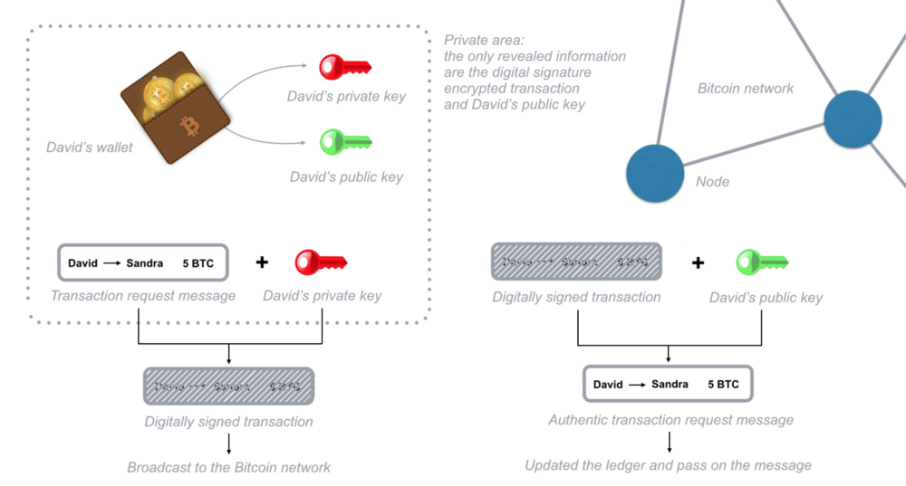
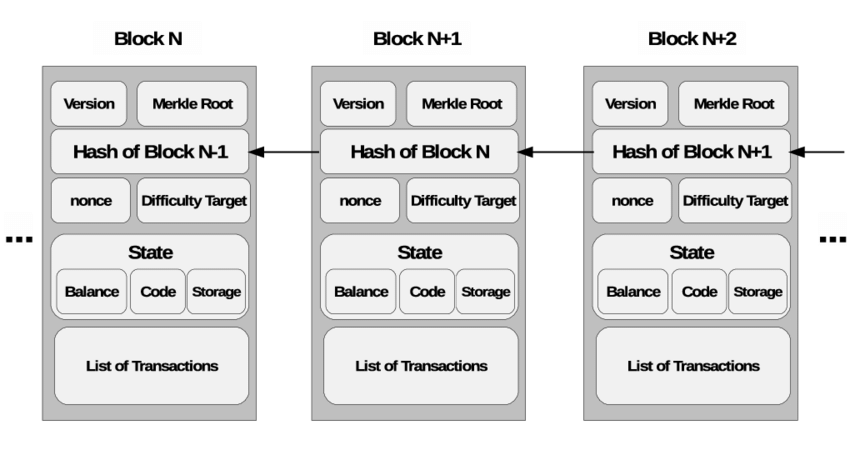
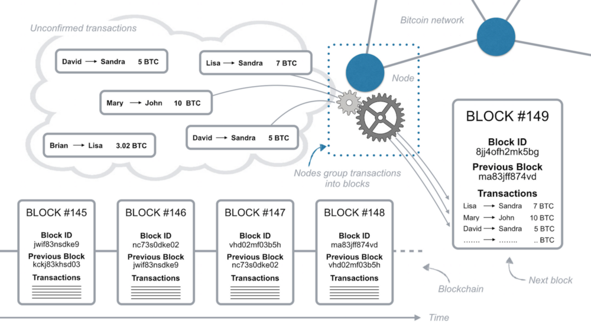
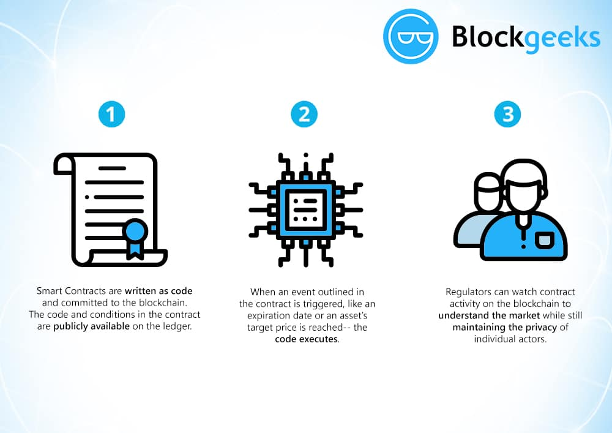

# PART 1 - Series of Creating Blockchain based C2 

**Note:- This Part will be Full theoretical Section of Blockchain in reference to Bitcoin.**

## Introduction To Blockchain

You guys must have heard a lot about Blockchain and it's relation with bitcoin and i know  there are a lot of better articles about explanation over this topic so I'll just go over the concepts we need to make our C2 powered on Blockchain.

## Blockchain (Reference from Bitcoin)

Blockchain is actually  `chain of blocks`. Basically it is a Decentralised ledger of transactions which is public for anyone to access,

The Blockchain has been designed in such a way that anyone can write and read to it but bitcoin enforces some rules and guidelines to prevent any kind of frauds in the transactions. 

## Transactions

These are the piece of data which has information like:-

* Date
* Time
* Amount
* Sender Wallet Address
* Receiver Wallet Address


Transactions contains all the information required by the nodes (Explained later in post) But before passing the Transaction The Wallet will use the private key of wallet owner which is then called a `Digitally Signed transaction` and then it will be broadcast to all the nodes in the network attached with the public key of sender.




Now the nodes will use public key to verify that whether the sender is the owner of the transaction or not.


## Blocks

Blocks  contains a collection of unconfirmed transactions which has occurred at that point of time which has to be confirmed by the nodes. 

### Block Header

* Version Number
* Hash of previous Block
* root hash of Merkle tree
* Time
* Current Difficulty
* Nonce


### Version Number

This is the version of the software used  This will show which set of rules were followed in this block, List of versions are displayed [here](https://bitcoin.org/en/developer-reference#block-versions)

### Hash of previous block

This is self explanatory Basically means this header value will contain the hash of previous block, That is how we can say it is a chain of blocks *a.k.a* BlockChain

This feature will  ensures no previous block can be changed without also changing this block's header

### Root Hash of Merkle Tree

Merkle root hash is the hash which is generated by the combination of all  [txid](https://bitcoin.org/en/glossary/txid) (Unique identifier of Transaction) 

This ensures that None of the transactions would be modified without changing this header.


### Time

This header will contain the time when miner started hashing this header and this header follows  [Unix epoch time](https://en.wikipedia.org/wiki/Unix_time)

The time should be greater than the median time of the previous 11 blocks otherwise it will not be accepted.

### Current Difficulty

This is a threshold value which is set at every 2016 blocks so as to make sure that a block would take at avg 10 min to solve 

Basically the hash which is generated from block should be less than or equal to this value to gain validity in blockchain.

So the lower this current difficulty value the harder it becomes to find a hash matching with these requirements.

For demo :- [https://www.youtube.com/watch?v=_160oMzblY8](https://www.youtube.com/watch?v=_160oMzblY8) 

### Nonce

This is a variable which will be incremented by the miners to find the hash which is lesser than the `current difficulty` hash,

So the hash would be calculated by [proof of work](https://en.bitcoin.it/wiki/Proof_of_work) Function and bitcoin uses [this](https://en.bitcoin.it/wiki/Hashcash) function for calculations.



### Block Body

When a miner constructs a block, it validates the transactions. That is, he checks that the sender actually has enough money to spend. He can easily read this information from the blockchain. The miner looks in the past blocks to see if the sender has even gotten ten Bitcoins if he wants to send ten Bitcoins.

The transactions in a block are not just in a list, but in a so-called Merkle Tree.


## Nodes

A node is a device on the blockchain network which will be the one who solves those block hashes and push the block on blockchain.



Basically nodes provide their computational power to calculate the hash and in return they get rewards as well as miners also takes fees to solve the hashes.

Bitcoin structure has been built in a way that every 4 years the value of rewards get halved,More on this [here](https://99bitcoins.com/bitcoin-mining/halving/). 

And because of that the miner's focus would divert more to getting fees from the bitcoin's sender so that is why the sender who is ready to pay more fees would get his/her transaction confirmed faster than others.

For more Info on how Bitcoin Works :- [https://www.youtube.com/watch?v=bBC-nXj3Ng4](https://www.youtube.com/watch?v=bBC-nXj3Ng4)


Now that we have covered basic concepts of blockchain by taking reference from Bitcoin let's move forward for our C2.

# Ethereum  Platform

Ethereum is a open source distributed computing platform which can run scripts like `smart contracts` 

**Ether** is a token whose blockchain is generated by the Ethereum platform and by utilising this token as a currency which will be paid to nodes who runs the scripts created on the `solidity` language which after being compiled creates a Byte code and this code will be used in EVM (Ethereum Virtual Machine) running on the nodes.

  ## Smart Contracts

Smart contracts are basically like a protocol which handles transactions or money transfer or anything of value and it can be created on language like solidity which will run on ```evm (Ethereum Virtual Machine)```


 

For more on [Smart Contracts](https://blockgeeks.com/guides/smart-contracts/)


Part 2 is available at [here](/2019/August/Blockchain/parts/2/Solidity-creation.html)
