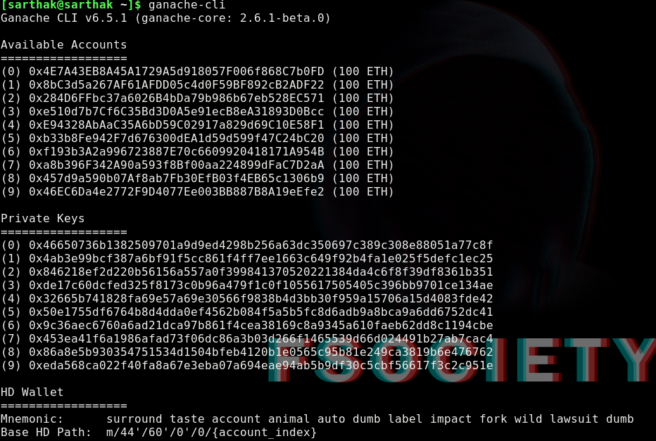
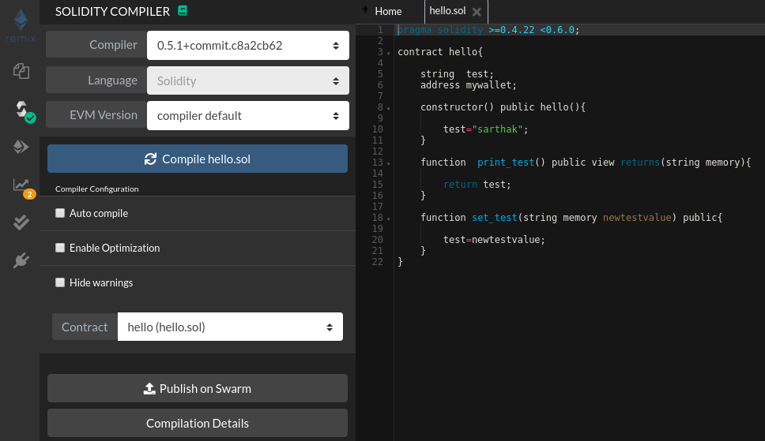
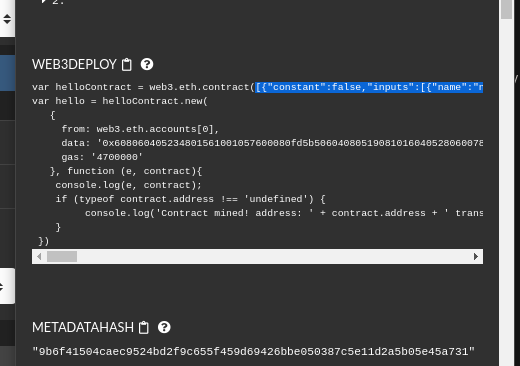
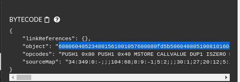
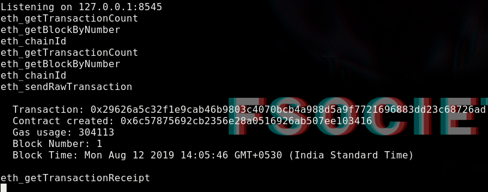

# PART 3 - Series of Creating Blockchain based C2

**Links Which would be necessary for this Section of series**

* [ganache-cli](https://www.npmjs.com/package/ganache-cli)
* [web3.py](https://web3py.readthedocs.io/en/stable/)
* [Dapp University web3.py](https://www.youtube.com/watch?v=SAi5rYFh7yw&list=PLS5SEs8ZftgVn38FOhXvLc0PoX_0hnJO9)

## Setting up personal blockchain

We would need our own personal blockchain to work until our program is ready for the real deal(i mean ethereum  servers).


For that install `ganache-cli` link has been given above and after installing we could directly fire it up as :-



ganache will start a server at `localhost:8545` and will give us 10 wallet accounts which has 100 ethereum each for us to test.

We have couple of options to work with ethereum node such as :-

* **IPC** :- it uses local filesystem but we need our program to run on api like infura so we will pass on this one
* **HTTP** :- self explanatory basically we will have api and we will interact with http api calls on blockchain
* **Websockets** :- This mechanism is faster than HTTP so we most likely use this protocol


Now we have a ethereum wallet and a protocol we will start our programming on python.


## Basics of Web3.py

Web3.py is a python module created for interaction with blockchains and to know more about it i have dropped a link in beginning of this article.

Let's create a basic program which will deploy our smart contract which we created in our previous section on our blockchain...

```python
from web3 import Web3

blockchain_server="ws://127.0.0.1:8545"

web3=Web3(Web3.WebsocketProvider(blockchain_server))
```


We imported web3 module and created a object of connection with the ganache-cli server whereas if you notice `ws` in the server address is basically the specification of websocket.

Now that we have the object of web3, we will create a `smart contract` by using `web3.eth.contract`  method.

 ```python
contract_obj=web3.eth.contract(abi=our_abi,bytecode=our_bytecode)
 ```

Things to note:-

* abi (Application Binary Interface) :- this is basically an encoding scheme to read more click [here](https://web3j.readthedocs.io/en/latest/abi.html)

* bytecode :- EVM (ethereum virtual machine) takes bytecode generated after the compilation of solidity.

So You guys would be wondering how we will generate `Abi` and `bytecode`, for that we will use `remix` website which we talked about in previous part.

 ### Generating Abi and Bytecode

First we will compile our solidity program on the remix website by clicking on compile button.




So after compiling is successfully done  we will click on the `compilation details` button and copy the line inside the `web3.eth.contract` ...




Which would look like this...

```python
from web3 import Web3

blockchain_server="ws://127.0.0.1:8545"

web3=Web3(Web3.WebsocketProvider(blockchain_server))

abi='[{"constant":false,"inputs":[{"name":"newtestvalue","type":"string"}],"name":"set_test","outputs":[],"payable":false,"stateMutability":"nonpayable","type":"function"},{"constant":true,"inputs":[],"name":"print_test","outputs":[{"name":"","type":"string"}],"payable":false,"stateMutability":"view","type":"function"},{"inputs":[],"payable":false,"stateMutability":"nonpayable","type":"constructor"}]'

```

This would look like this now time to copy the bytecode so we will copy from `object` variable of `bytecode` section




Now with bytecode and abi we will also implement our contract object ...

```python
from web3 import Web3

blockchain_server="ws://127.0.0.1:8545"

web3=Web3(Web3.WebsocketProvider(blockchain_server))

abi='[{"constant":false,"inputs":[{"name":"newtestvalue","type":"string"}],"name":"set_test","outputs":[],"payable":false,"stateMutability":"nonpayable","type":"function"},{"constant":true,"inputs":[],"name":"print_test","outputs":[{"name":"","type":"string"}],"payable":false,"stateMutability":"view","type":"function"},{"inputs":[],"payable":false,"stateMutability":"nonpayable","type":"constructor"}]'

bytecode="608060405234801561001057600080fd5b506040805190810160405280600781526020017f7361727468616b000000000000000000000000000000000000000000000000008152506000908051906020019061005c929190610062565b50610107565b828054600181600116156101000203166002900490600052602060002090601f016020900481019282601f106100a357805160ff19168380011785556100d1565b828001600101855582156100d1579182015b828111156100d05782518255916020019190600101906100b5565b5b5090506100de91906100e2565b5090565b61010491905b808211156101005760008160009055506001016100e8565b5090565b90565b610330806101166000396000f3fe608060405260043610610046576000357c0100000000000000000000000000000000000000000000000000000000900480635613a7961461004b578063d5221ec814610113575b600080fd5b34801561005757600080fd5b506101116004803603602081101561006e57600080fd5b810190808035906020019064010000000081111561008b57600080fd5b82018360208201111561009d57600080fd5b803590602001918460018302840111640100000000831117156100bf57600080fd5b91908080601f016020809104026020016040519081016040528093929190818152602001838380828437600081840152601f19601f8201169050808301925050505050505091929192905050506101a3565b005b34801561011f57600080fd5b506101286101bd565b6040518080602001828103825283818151815260200191508051906020019080838360005b8381101561016857808201518184015260208101905061014d565b50505050905090810190601f1680156101955780820380516001836020036101000a031916815260200191505b509250505060405180910390f35b80600090805190602001906101b992919061025f565b5050565b606060008054600181600116156101000203166002900480601f0160208091040260200160405190810160405280929190818152602001828054600181600116156101000203166002900480156102555780601f1061022a57610100808354040283529160200191610255565b820191906000526020600020905b81548152906001019060200180831161023857829003601f168201915b5050505050905090565b828054600181600116156101000203166002900490600052602060002090601f016020900481019282601f106102a057805160ff19168380011785556102ce565b828001600101855582156102ce579182015b828111156102cd5782518255916020019190600101906102b2565b5b5090506102db91906102df565b5090565b61030191905b808211156102fd5760008160009055506001016102e5565b5090565b9056fea165627a7a723058209b6f41504caec9524bd2f9c655f459d69426bbe050387c5e11d2a5b05e45a7310029"

contract_obj = web3.eth.contract(abi=abi,bytecode=bytecode)

```

### Construct the Transaction

We have a contract_obj now so the next step would be building our transaction for deployment and syntax for transaction is :-

```
construct_txn = contract_obj.constructor().buildTransaction({
    'from': wallet_key,
    'nonce': web3.eth.getTransactionCount(wallet_key),
    'gas': web3.eth.getBlock('latest').gasLimit,
    'gasPrice': web3.toWei('30', 'gwei')})
```

Things to note here :-

* **contract_obj.constructor()** :- this means when the transaction is deployed the constructor of the contract should be deployed.

* **buildTransaction** :- this is the function which will build the transaction.

* **from** :- our wallet address.

* **nonce** :- this is basically like a counter which should be set in order to tell which transaction number is this from our wallet address, basically a nonce is an arbitrary number that can be used just once in a cryptographic communication.

* **gas** :- this specifies the maximum limit which can be set on transaction it is set by specific blockchain platform.

* **gas price **:- amount of Ether you’re willing to pay for every unit of gas, and is usually measured in *Gwei*. An analogy for gas price.

  

Now we will construct the transaction on our python script  but before that we will use a wallet key and private key which is given from ganache-cli

```python
from web3 import Web3

blockchain_server="ws://127.0.0.1:8545"

web3=Web3(Web3.WebsocketProvider(blockchain_server))

abi='[{"constant":false,"inputs":[{"name":"newtestvalue","type":"string"}],"name":"set_test","outputs":[],"payable":false,"stateMutability":"nonpayable","type":"function"},{"constant":true,"inputs":[],"name":"print_test","outputs":[{"name":"","type":"string"}],"payable":false,"stateMutability":"view","type":"function"},{"inputs":[],"payable":false,"stateMutability":"nonpayable","type":"constructor"}]'

bytecode="608060405234801561001057600080fd5b506040805190810160405280600781526020017f7361727468616b000000000000000000000000000000000000000000000000008152506000908051906020019061005c929190610062565b50610107565b828054600181600116156101000203166002900490600052602060002090601f016020900481019282601f106100a357805160ff19168380011785556100d1565b828001600101855582156100d1579182015b828111156100d05782518255916020019190600101906100b5565b5b5090506100de91906100e2565b5090565b61010491905b808211156101005760008160009055506001016100e8565b5090565b90565b610330806101166000396000f3fe608060405260043610610046576000357c0100000000000000000000000000000000000000000000000000000000900480635613a7961461004b578063d5221ec814610113575b600080fd5b34801561005757600080fd5b506101116004803603602081101561006e57600080fd5b810190808035906020019064010000000081111561008b57600080fd5b82018360208201111561009d57600080fd5b803590602001918460018302840111640100000000831117156100bf57600080fd5b91908080601f016020809104026020016040519081016040528093929190818152602001838380828437600081840152601f19601f8201169050808301925050505050505091929192905050506101a3565b005b34801561011f57600080fd5b506101286101bd565b6040518080602001828103825283818151815260200191508051906020019080838360005b8381101561016857808201518184015260208101905061014d565b50505050905090810190601f1680156101955780820380516001836020036101000a031916815260200191505b509250505060405180910390f35b80600090805190602001906101b992919061025f565b5050565b606060008054600181600116156101000203166002900480601f0160208091040260200160405190810160405280929190818152602001828054600181600116156101000203166002900480156102555780601f1061022a57610100808354040283529160200191610255565b820191906000526020600020905b81548152906001019060200180831161023857829003601f168201915b5050505050905090565b828054600181600116156101000203166002900490600052602060002090601f016020900481019282601f106102a057805160ff19168380011785556102ce565b828001600101855582156102ce579182015b828111156102cd5782518255916020019190600101906102b2565b5b5090506102db91906102df565b5090565b61030191905b808211156102fd5760008160009055506001016102e5565b5090565b9056fea165627a7a723058209b6f41504caec9524bd2f9c655f459d69426bbe050387c5e11d2a5b05e45a7310029"

contract_obj = web3.eth.contract(abi=abi,bytecode=bytecode)

wallet_key="0x4E7A43EB8A45A1729A5d918057F006f868C7b0FD"

private_key="0x46650736b1382509701a9d9ed4298b256a63dc350697c389c308e88051a77c8f"

construct_txn = contract_obj.constructor().buildTransaction({
    'from': wallet_key,
    'nonce': web3.eth.getTransactionCount(wallet_key),
    'gas': web3.eth.getBlock('latest').gasLimit,
    'gasPrice': web3.toWei('30', 'gwei')})
```

### Signing the Transaction

private_key would be used now when we have sign the transaction, the reason why we have to sign the transaction has been already explained in first part of the series.

syntax to sign:-

```
signed = web3.eth.account.signTransaction(construct_txn,private_key)
```

the method `signTransaction` would be used to sign it which accepts two arguments :-

1) The transaction which has to be signed

2) The private key associated with the wallet

### Deployment of Transaction

Now we will deploy the transaction on the blockchain which will generate a hash of transaction.

Syntax:-

```python
    tx_hash = web3.eth.sendRawTransaction(signed.rawTransaction).hex()
```

The `sendRawTransaction` Will send the signed transaction and this method will return a hex value which is basically just an hash which represents the contract on blockchain.

<br/>

But we also want to know that when our transaction is being mined by miners (usually it takes less than 2 minutes to get mined but we are on ganache so it will mine instantly)

syntax:-

```python
    tx_recipt = web3.eth.waitForTransactionReceipt(tx_hash)
```

The `waitForTransactionReceipt` method will wait until the transaction is mined and will generate a transaction receipt.

So final script would look like this

```python
from web3 import Web3

blockchain_server="ws://127.0.0.1:8545"

web3=Web3(Web3.WebsocketProvider(blockchain_server))

abi='[{"constant":false,"inputs":[{"name":"newtestvalue","type":"string"}],"name":"set_test","outputs":[],"payable":false,"stateMutability":"nonpayable","type":"function"},{"constant":true,"inputs":[],"name":"print_test","outputs":[{"name":"","type":"string"}],"payable":false,"stateMutability":"view","type":"function"},{"inputs":[],"payable":false,"stateMutability":"nonpayable","type":"constructor"}]'

bytecode="608060405234801561001057600080fd5b506040805190810160405280600781526020017f7361727468616b000000000000000000000000000000000000000000000000008152506000908051906020019061005c929190610062565b50610107565b828054600181600116156101000203166002900490600052602060002090601f016020900481019282601f106100a357805160ff19168380011785556100d1565b828001600101855582156100d1579182015b828111156100d05782518255916020019190600101906100b5565b5b5090506100de91906100e2565b5090565b61010491905b808211156101005760008160009055506001016100e8565b5090565b90565b610330806101166000396000f3fe608060405260043610610046576000357c0100000000000000000000000000000000000000000000000000000000900480635613a7961461004b578063d5221ec814610113575b600080fd5b34801561005757600080fd5b506101116004803603602081101561006e57600080fd5b810190808035906020019064010000000081111561008b57600080fd5b82018360208201111561009d57600080fd5b803590602001918460018302840111640100000000831117156100bf57600080fd5b91908080601f016020809104026020016040519081016040528093929190818152602001838380828437600081840152601f19601f8201169050808301925050505050505091929192905050506101a3565b005b34801561011f57600080fd5b506101286101bd565b6040518080602001828103825283818151815260200191508051906020019080838360005b8381101561016857808201518184015260208101905061014d565b50505050905090810190601f1680156101955780820380516001836020036101000a031916815260200191505b509250505060405180910390f35b80600090805190602001906101b992919061025f565b5050565b606060008054600181600116156101000203166002900480601f0160208091040260200160405190810160405280929190818152602001828054600181600116156101000203166002900480156102555780601f1061022a57610100808354040283529160200191610255565b820191906000526020600020905b81548152906001019060200180831161023857829003601f168201915b5050505050905090565b828054600181600116156101000203166002900490600052602060002090601f016020900481019282601f106102a057805160ff19168380011785556102ce565b828001600101855582156102ce579182015b828111156102cd5782518255916020019190600101906102b2565b5b5090506102db91906102df565b5090565b61030191905b808211156102fd5760008160009055506001016102e5565b5090565b9056fea165627a7a723058209b6f41504caec9524bd2f9c655f459d69426bbe050387c5e11d2a5b05e45a7310029"

contract_obj = web3.eth.contract(abi=abi,bytecode=bytecode)

wallet_key="0x4E7A43EB8A45A1729A5d918057F006f868C7b0FD"

private_key="0x46650736b1382509701a9d9ed4298b256a63dc350697c389c308e88051a77c8f"

construct_txn = contract_obj.constructor().buildTransaction({
    'from': wallet_key,
    'nonce': web3.eth.getTransactionCount(wallet_key),
    'gas': web3.eth.getBlock('latest').gasLimit,
    'gasPrice': web3.toWei('30', 'gwei')})

signed = web3.eth.account.signTransaction(construct_txn,private_key)


tx_hash = web3.eth.sendRawTransaction(signed.rawTransaction).hex()
tx_recipt = web3.eth.waitForTransactionReceipt(tx_hash)

if tx_recipt:
    print(tx_recipt)
```

The output on terminal would be :-

```bash
AttributeDict({'transactionHash': HexBytes('0x29626a5c32f1e9cab46b9803c4070bcb4a988d5a9f7721696883dd23c68726ad'), 'transactionIndex': 0, 'blockHash': HexBytes('0x12416f7facc1c05da37f58b61afc8992d83e66073ac1066fb1860aba7aa7151d'), 'blockNumber': 1, 'from': '0x4e7a43eb8a45a1729a5d918057f006f868c7b0fd', 'to': None, 'gasUsed': 304113, 'cumulativeGasUsed': 304113, 'contractAddress': '0x6c57875692cb2356E28A0516926aB507eE103416', 'logs': [], 'status': 1, 'logsBloom': HexBytes('0x00000000000000000000000000000000000000000000000000000000000000000000000000000000000000000000000000000000000000000000000000000000000000000000000000000000000000000000000000000000000000000000000000000000000000000000000000000000000000000000000000000000000000000000000000000000000000000000000000000000000000000000000000000000000000000000000000000000000000000000000000000000000000000000000000000000000000000000000000000000000000000000000000000000000000000000000000000000000000000000000000000000000000000000000000000000'), 'v': '0x0a95', 'r': '0xb95e7367a2ccbd9ed08981344ba471681e2f56a3030dea9fd0729c3a009f2dd3', 's': '0x35ddf864473d35c6da77a8e29edf5e24c260e66de5f8fa50da26e63c591b742f'})
```

And the output on ganache would be like this :-



Our first block in our blockchain has been created, In next part we will discuss about interactions with functions and events.
